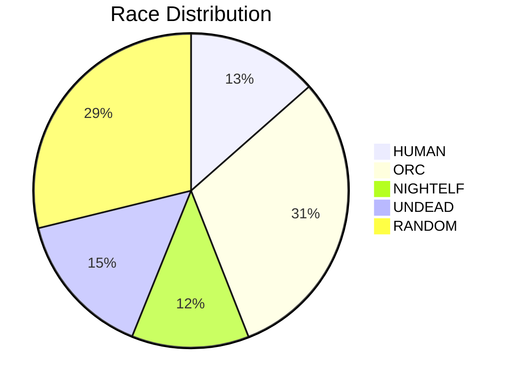

# ToD's team distribution

This was quickly created to analyse the statistics of the distribution of the different races on ToD's 4v4 team versus the enemy's team. This scrapes its data from https://w3champions.com/ using selenium.

### The Theory:

In Warcraft III we have 4 playable races plus the ability to que into a game as random which means you will be assigned a race at the games start with (hopefully) equal probability. Now if we assume that there is a perfectly even race and random distribution (which we know is not true) we expect:
- 20% Human
- 20% Orc
- 20% Nightelf
- 20% Undead
- 20% Random
  - 25% Human
  - 25% Orc
  - 25% Nightelf
  - 25% Undead 

Under this ussumption we have an expected value of 1.75 humans on ToD's team and 1 human on the enemy team.

#### Better Assumptions:
One option here is to use the distribution of the enemy team as representitive of the distribution of the player base. This has a couple of advantages namley:
1. This accuratly captures the distribution of races at the mmr of ToD
2. This also captures the distribution at the specific time which ToD plays
3. This automatically weights the races by the amount they play not just the number of players

Of course there are many drawbacks:
1. This invalidates any EV statistics about the race distribution of the enemy team as that is where the data is taken from so it will always match perfectly
2. Given matchmaking trys to balance out mmr on the two teams this may not be perfectly representitive, as ToD's mmr is quite high therefore skewing this distribution away from low mmr players that are more likley to be on ToD's team towards other high mmr players which are more likley to be on the enemy team.

Using the data shown below we get that the race distribution from this assumption is:

### Results:
Race distribution over 495 games:

ToD's Team: (Including ToD)
| Race             |   Number |
|------------------|----------|
| RANDOM_HUMAN     |       98 |
| UNDEAD           |      169 |
| RANDOM_NIGHT_ELF |      129 |
| RANDOM_UNDEAD    |       95 |
| RANDOM_ORC       |      106 |
| NIGHT_ELF        |      189 |
| HUMAN            |      748 |
| ORC              |      446 |

Enemy's Team:
| Race             |   Number |
|------------------|----------|
| RANDOM_HUMAN     |      142 |
| UNDEAD           |      298 |
| RANDOM_NIGHT_ELF |      120 |
| RANDOM_UNDEAD    |      144 |
| RANDOM           |        1 |
| RANDOM_ORC       |      164 |
| NIGHT_ELF        |      239 |
| HUMAN            |      267 |
| ORC              |      605 |

Total number of humans including randoms (including ToD):

ToD's team: 846

Enemy's team: 409

The one pure RANDOM race on the enemy team seems to be an error inherited from W3C.

This data is from 5/26/2022.

#### Analysis:

Using the assumed distribution described above we expect ToD's team to have:
&space;&plus;&space;3\cdot&space;%HUMAN&space;&plus;&space;\frac{1}{4}\cdot&space;3&space;\cdot&space;%RANDOM\\&=&space;1&space;(ToD)&space;&plus;&space;3\cdot&space;.13&space;&plus;&space;\frac{1}{4}\cdot&space;3&space;\cdot&space;.29\\&=&space;1.6075\end{align*})

Using the data above we see that ToD has 748 + 98 = 846 humans on his team over 495 games giving him on average 1.709 humans.

### Running the Code:

Given that this was a hacky quick project it is kind of a mess right now but if you have beautiful soup, selenium, firefox web driver, and tabulate you should be able to run the script as is and the tables shown above will print out. It will go through all the complete games of 4v4 that ToD has completed so you might get larger numbers depending on when you run the script. Hopefully I get around to cleaning it up and making it trivial to run.
